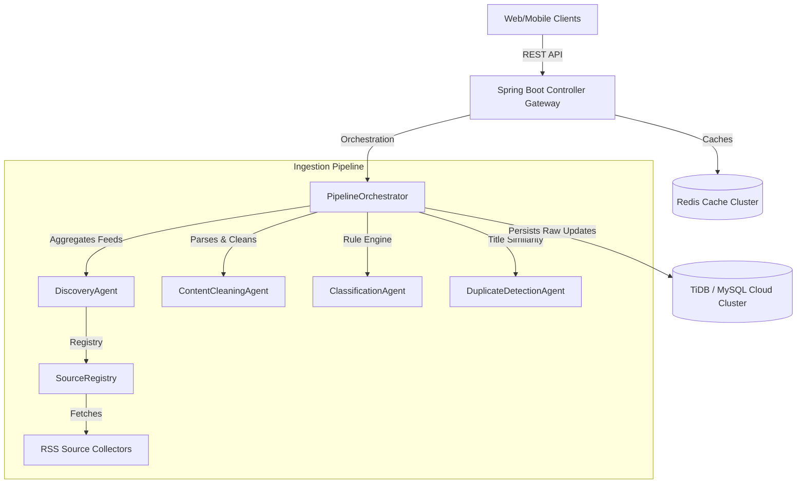

# Technical Architecture Document

This document details the software architecture, design principles, and deployment topology of **TechPulse AI**.

---

## 1. System Architecture

The following diagram illustrates the high-level system components and their relationships:

---

## 2. SOLID Design Principles Analysis

The architecture of the TechPulse AI ingestion pipeline is strictly designed around SOLID software design principles:

1. **Single Responsibility Principle (SRP)**:
   - Each agent has exactly one task: `DiscoveryAgent` fetches data, `ContentCleaningAgent` sanitizes HTML and URLs, `ClassificationAgent` categorizes content, and `DuplicateDetectionAgent` deduplicates.
2. **Open/Closed Principle (OCP)**:
   - Adding a new category requires updating `application.yml` classification rules, and adding a new source type requires adding a collector implementation and registering it in the registry—without modifying any existing agent code.
3. **Liskov Substitution Principle (LSP)**:
   - Collectors implement the `SourceCollector` interface, and agents implement `Agent<I, O>`. Any implementation can be substituted cleanly without breaking the orchestration flow.
4. **Interface Segregation Principle (ISP)**:
   - Small, single-purpose interfaces are used (e.g., `Agent`, `SourceCollector`, `SourceRegistry`) instead of bloated, monolithic service interfaces.
5. **Dependency Inversion Principle (DIP)**:
   - High-level orchestrators and controllers depend on interfaces (`Agent`, `SourceRegistry`), not on concrete collector classes. Spring Boot dependency injection manages life cycles.
