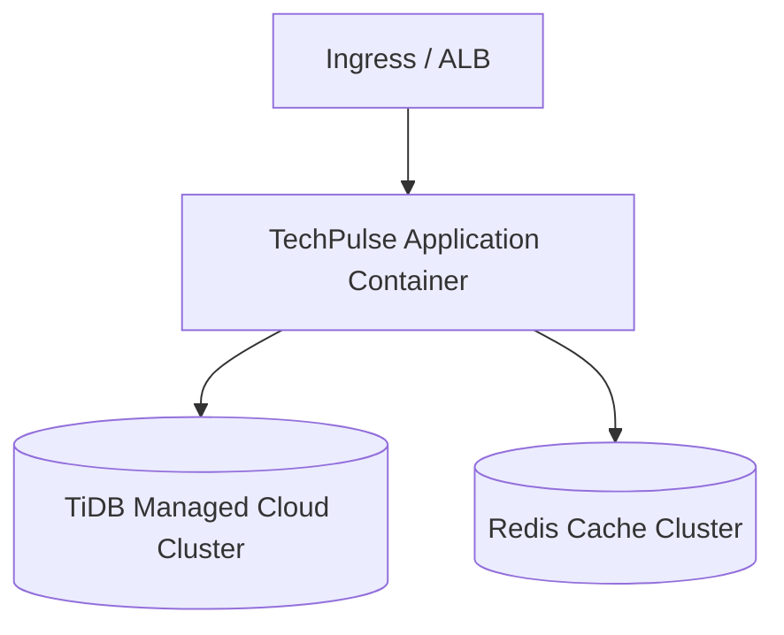

# Deployment Guide

This document details the configuration parameters, environment keys, and deployment requirements for **TechPulse AI**.

---

## 1. Environment Configuration

All configuration is externalized in `application.yml` and can be overridden using environment variables in containerized deployments.

| Property Key | Environment Variable | Default Value | Description |
|---|---|---|---|
| `spring.datasource.url` | `SPRING_DATASOURCE_URL` | JDBC TiDB Cloud URL | Datastore connection string. |
| `spring.datasource.username` | `SPRING_DATASOURCE_USERNAME` | - | Database username. |
| `spring.datasource.password` | `SPRING_DATASOURCE_PASSWORD` | - | Database password. |
| `spring.data.redis.host` | `SPRING_DATA_REDIS_HOST` | `localhost` | Redis host for caching. |
| `spring.data.redis.port` | `SPRING_DATA_REDIS_PORT` | `6379` | Redis port. |
| `app.classification.keywords.*` | - | Configured Keywords | Keyword maps for the classification engine. |

---

## 2. Deployment Topology

The typical production deployment uses Docker containers managed by a container orchestrator (e.g. Kubernetes, AWS ECS):

- **Scale Out**: The pipeline orchestrator generates unique UUIDs for all event IDs and raw records, enabling multi-node API deployments without synchronization collisions.
- **Failover**: Health checks monitor DB, Redis, and pipeline statuses, facilitating automated restarts on network failures.
