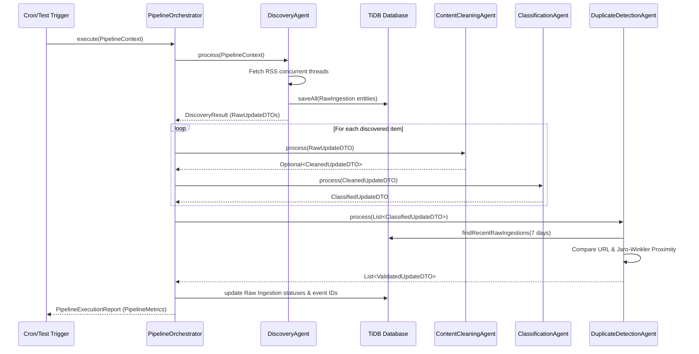

# Pipeline Processing and Data Flows

This document details the sequential pipeline phases, data transformations, and DTO structures within the **TechPulse AI** ingestion engine.

---

## 1. Pipeline Execution Flow Diagram

The following diagram traces the DTO transformation pipeline from a raw external feed up to the deduplicated event output:

---

## 2. DTO Specifications

### `RawUpdateDTO`
Represents the raw, unaltered data fetched directly from technology sources. Holds title, description content, feed link, and metadata (source type, timestamps).

### `CleanedUpdateDTO`
Represents the cleaned and normalized article state. All HTML elements are stripped, trailing and double slashes normalized, lowercased hostnames applied, and query parameters trimmed.

### `ClassifiedUpdateDTO`
Contains the cleaned DTO coupled with a list of matching `CategoryType` enums and their calculated normalized confidence scores.

### `ValidatedUpdateDTO`
Encapsulates the classified DTO and includes event-oriented metadata: `eventId` (UUID), `isDuplicate` (boolean), `matchScore` (Jaro-Winkler metric), and `matchReason`.
